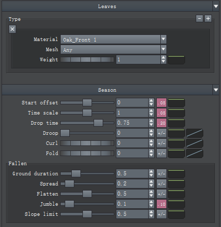
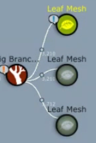

季节设置

Start offset：起始季节偏移

Time scale：年限缩放，1 代表 1 年

Drop time：树叶要掉落时，挂在树上的时间

Dop：快下落时，树叶下垂程度

Curl：卷曲

Fold：折叠

**Fallen 落叶**

Ground duration：地面落叶持续时间

Spread：非垂直坠落，扩散到四周

下面 3 个需要上面的下垂、卷曲和折叠

Flatten：扁平化

Jumble：混乱

Slope Limit：斜坡限制。与外部模型交互

## 设置季节材质

可以先用材质复制几个一样的

设置材质组

不同材质设置不同季节曲线

划拉上去

