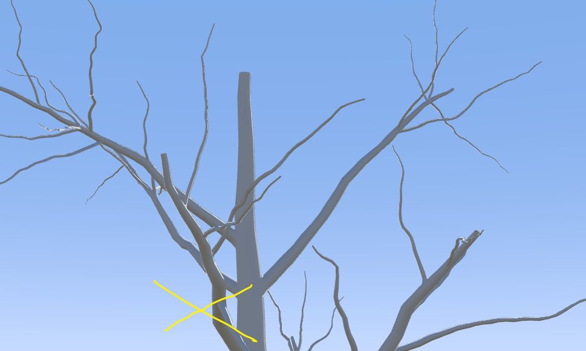
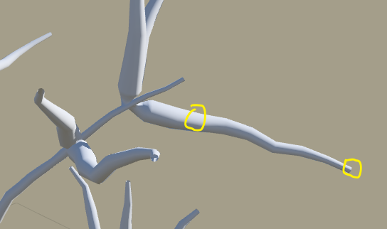

Type：类型

- Polygon：几何体过渡

- SubD surface（rectangular attachment）：直接插（矩形附着）

- SubD surface（arbitrary attachment）：直接插（任意形状附着）

Visibity：显示范围，可以绘制曲线。高于 0.5 显示，低于则不显示。比如 值显示上面的树枝

## Radius

Abosulte：半径值

parent：继承父节点占比

Clamp of parent：不得比父节点粗

Length compensation：末端半径补偿，末端也可以变粗

Length kill ratio：过长删除？

---

贴图可能出问题，所以有以下 3 个参数

Light seam reduciton：接缝调整

Roll：旋转

Smooth：平滑接缝

## Welding 焊接

交界处是否焊接

左不焊接 | 右焊接

Keep：焊接区域？可以绘制曲线

Keep failed

Force ray casts

Offset

**Speard**

沿树干传播。

下图是从 0 到 20

Amount：数量

Upper scale：向上传播程度

Lower scale：向下传播程度

**Blend**

焊接处与枝干混合程度

Texture：控制混合范围

Texture scale

Contrast

Noise：噪波

Lighting

## Subdivision 细分

需要开启第一项设置 SubD surface 细分表面

同上，但是控制的是直接嵌入的部分

## Squash 挤入

挤扁了都。应该是 3D 往 2D 挤

Amount：

Rotate

## Splits

Chance：分裂概率，上图为 66.7%

Balance：平衡，分裂出来的大小占比，上图是 0.5，一样大

Seed：随机种子值

**Spread**

分裂出来两个端口传输（可以理解为移动）

**Expand**

分裂出来两个端口向外拓展（可以理解为放大）

**Smooth**

平滑

Inner

Outer
